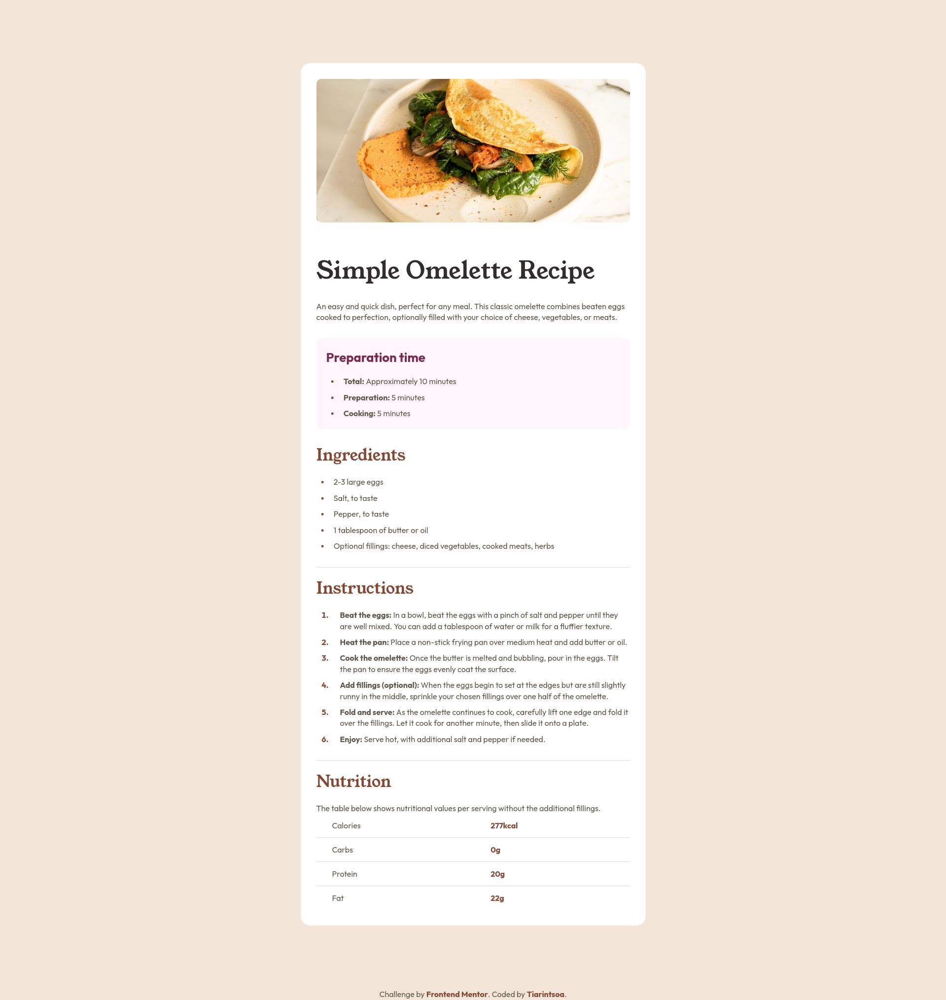

# Frontend Mentor - Recipe page solution

This is a solution to the [Recipe page challenge on Frontend Mentor](https://www.frontendmentor.io/challenges/recipe-page-KiTsR8QQKm). Frontend Mentor challenges help you improve your coding skills by building realistic projects. 

## Table of contents

- [Overview](#overview)
  - [The challenge](#the-challenge)
  - [Screenshot](#screenshot)
  - [Links](#links)
- [My process](#my-process)
  - [Built with](#built-with)
  - [What I learned](#what-i-learned)
  - [Useful resources](#useful-resources)
- [Author](#author)

## Overview

### Screenshot



### Links

- Solution URL: [click here](https://www.frontendmentor.io/solutions/recipe-page-Fr2QqrrCdr)
- Live Site URL: [click here](https://legendaryghost.github.io/recipe-page/)

## My process

### Built with

- Semantic HTML5 markup
- CSS custom properties
- Flexbox
- CSS Grid
- Mobile-first workflow

### What I learned

I learned how to center the bullet/marker of a list element using the ::before pseudo-element instead

```css
ul {
  list-style: none;
}

ul li {
  display: -webkit-box;
  display: -ms-flexbox;
  display: flex;
  -webkit-box-align: center;
  -ms-flex-align: center;
  align-items: center;
  gap: var(--medium-spacing);
  padding-left: var(--small-spacing);
}

ul li::before {
  content: '\2B24 ';
  color: var(--brown-800);
  font-size: .3rem;
}
```

### Useful resources

- [Stack overflow](https://stackoverflow.com/questions/69874236/how-can-i-vertically-align-a-list-item-marker) - This **stack overflow** question helped me center the bullet of the list elements 

## Author

- Frontend Mentor - [@tiarintsoa](https://www.frontendmentor.io/profile/LegendaryGhost)
